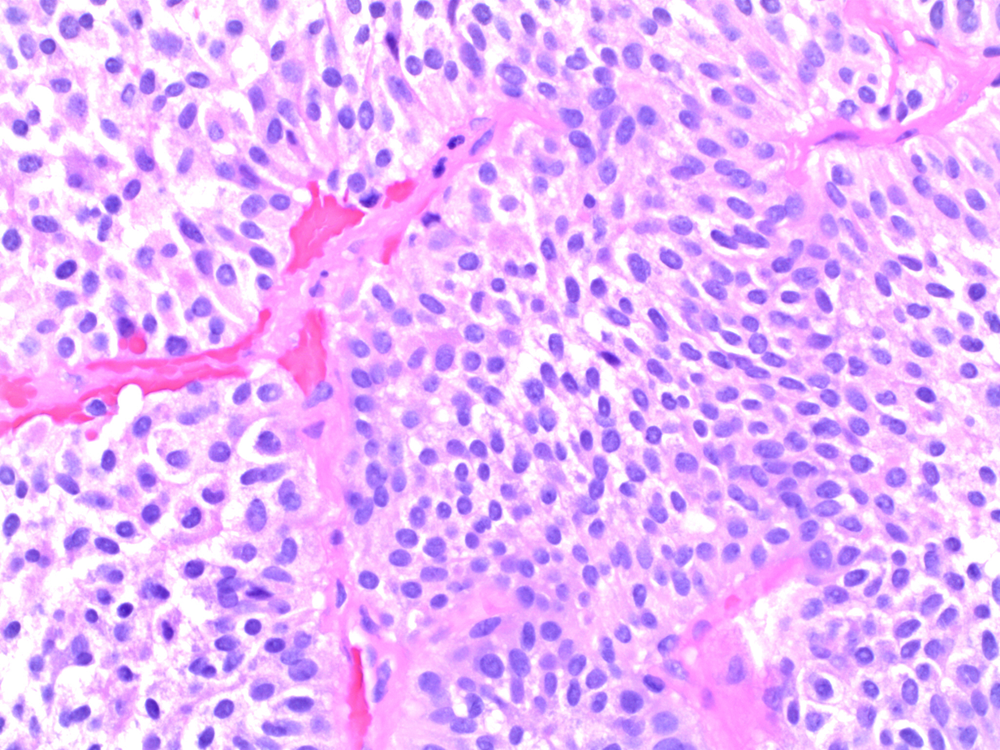
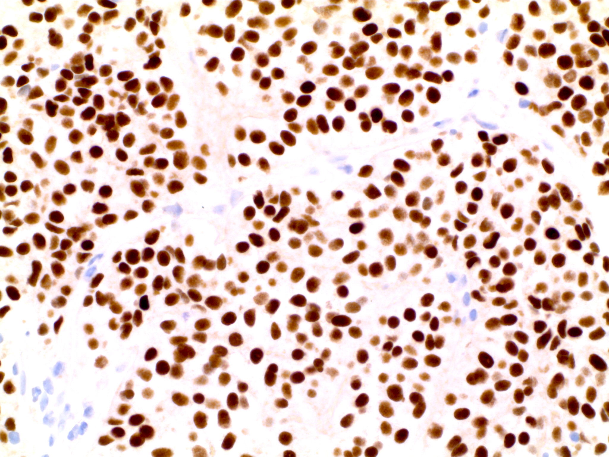

```{r setup, include=FALSE}
knitr::opts_chunk$set(echo = TRUE)
```

###CHAPTER: Stains (IHC and Special) and Molecular Markers

###SECTION: Stains and Molecular Markers by Subspecialty = Pituitary stains

###STAIN: SF-1

***

###Definition/general:
* Member of the steroid receptor superfamily; a transcription factor that regulates cytochrome P450 genes
* Found in anterior pituitary cells containing gonadotropins which produce luteinizing hormone (LH) or follicle-stimulating hormone (FSH), but not in other adenohypophyseal cell types [(J Clin Endocrinol Metab 1996;81:2165)](https://www.ncbi.nlm.nih.gov/pubmed?term=%22The+Journal+of+clinical+endocrinology+and+metabolism%22%5BJour%5D+AND+2165%5Bpage%5D+AND+1996%5Bpdat%5D&cmd=detailssearch).
* Gonadotroph adenomas comprise the largest category of pituitary adenomas (ref McDonald 2017, Mete 2018) [(Arch Pathol Lab Med 2017;141:104,](https://www.ncbi.nlm.nih.gov/pubmed?term=%22Archives+of+pathology+%26+laboratory+medicine%22%5BJour%5D+AND+2017%5Bpdat%5D+AND+McDonald%5Bauthor%5D+AND+Steroidogenic&TransSchema=title&cmd=detailssearch) [ Mod Pathol 2018;31:900)](https://www.ncbi.nlm.nih.gov/pubmed?term=2018%5Bpdat%5D+AND+Mete%2C+Ozgur%5Bauthor%5D+AND+epidemiology+and+biomarker&TransSchema=title&cmd=detailssearch)
*Also found within adrenal cortex, granulosa and theca cells of the ovary and Leydig cells of the testis 

###Essential features:
*	Strong nuclear staining is observed within gonadotrophs, pituitary adenomas that develop along this line of differentiation and in other (non-pituitary) tumors that express SF-1.

###Terminology:
*	Pituitary adenoma = “pituitary neuroendocrine tumor”  (PitNET) in 2017 proposal [(Endocr Relat Cancer 2017;24:C5)](https://www.ncbi.nlm.nih.gov/pubmed?term=2017%5Bpdat%5D+AND+Asa+S%5Bauthor%5D+AND+from+pituitary+adenoma&TransSchema=title&cmd=detailssearch)

###Pathophysiology:
*	Pituitary adenomas reflect anterior pituitary development
*	LH and FSH immunostains also mark gonadotroph adenomas, but are much less sensitive (althought quite specific) for gonadotroph adenomas [(Mod Pathol 2018;31:900)](https://www.ncbi.nlm.nih.gov/pubmed?term=2018%5Bpdat%5D+AND+Mete%2C+Ozgur%5Bauthor%5D+AND+epidemiology+and+biomarker&TransSchema=title&cmd=detailssearch)

###Clinical features: 
*	Most gonadotroph adenomas are hormonally silent
*	Frequently present as macroadenomas (that is, > 1 cm)

###Uses for Pathologists:
*	Useful for diagnosis of gonadotroph adenomas (1, 2). 
*	More sensitive than antibodies to LH and FSH [(Mod Pathol 2018;31:900)](https://www.ncbi.nlm.nih.gov/pubmed?term=2018%5Bpdat%5D+AND+Mete%2C+Ozgur%5Bauthor%5D+AND+epidemiology+and+biomarker&TransSchema=title&cmd=detailssearch) 
*	Also present within normal anterior pituitary gland, so the presence of pituitary adenoma must be confirmed on H&E stains (occasionally with the support of ancillary stains such as reticulin stains for normal adenohypophyseal architecture). 
*	Also a sensitive marker of sex cord stromal tumors of the ovary (3-5), and can be used to distinguish these tumors from other types of ovarian tumor.

###Prognostic Factors:
*	Adenoma type is considered a prognostic factor
*	

###Interpretation: 

###Micro description:

###Micro images:


###Virtual slides:


###Positive staining (normal):
* Scattered gonadotrophs in normal adenohypophysis

###Positive staining (tumors):
* Gonadotroph pituitary adenomas
* Rare plurihormonal pituitary adenomas

###Negative staining (normal):
* Corticotrophs, Pit-1 family adenohypophysial cells (producing prolactin, growth hormone, TSH)
* Pituitary adenomas in the Pit-1 family, corticotroph family

###Molecular / cytogenetics descriptions:
NA

###Molecular / cytogenetics images:
NA

###Additional references:
1.	Asa SL, Bamberger AM, Cao B, Wong M, Parker KL, Ezzat S. The transcription activator steroidogenic factor-1 is preferentially expressed in the human pituitary gonadotroph. J Clin Endocrinol Metab. 1996;81(6):2165-70.
2.	Luo X, Ikeda Y, Parker KL. A cell-specific nuclear receptor is essential for adrenal and gonadal development and sexual differentiation. Cell. 1994;77(4):481-90.
3.	Rabban JT, Zaloudek CJ. A practical approach to immunohistochemical diagnosis of ovarian germ cell tumours and sex cord-stromal tumours. Histopathology. 2013;62(1):71-88. doi: 10.1111/his.12052.
4.	Zhao C, Barner R, Vinh TN, McManus K, Dabbs D, Vang R. SF-1 is a diagnostically useful immunohistochemical marker and comparable to other sex cord-stromal tumor markers for the differential diagnosis of ovarian sertoli cell tumor. Int J Gynecol Pathol. 2008;27(4):507-14. doi: 10.1097/PGP.0b013e31817c1b0a.
5.	Zhao C, Vinh TN, McManus K, Dabbs D, Barner R, Vang R. Identification of the most sensitive and robust immunohistochemical markers in different categories of ovarian sex cord-stromal tumors. Am J Surg Pathol. 2009;33(3):354-66. doi: 10.1097/PAS.0b013e318188373d.

###Board Review Question(s)
A 57-year-old male presents with bitemporal hemianopsia, mildly elevated serum prolactin and MRI showing a 2.5 cm mass within the sella turcica, which is noted to extend upward and push on the optic chiasm. Physical examination reveals no signs of hormone excess (no evidence of gynecomastia, galactorrhea, Cushing's syndrome, acromegaly, etc.) and formal visual field testing confirms decreased vision in the outer half of the visual fields. Transsphenoidal resection confirms pituitary adenoma by routine stains. The adenoma shows the following immunoreactivity: SF-1 positive, Pit-1 negative, ACTH negative. 
How is this adenoma best classified?
A. Prolactinoma
B. Corticotroph adenoma
C. Gonadotroph adenoma
D. Null cell adenoma

###Board Review Answer(s)
C. Gonadotroph adenoma. Absence of signs of hormone excess is the usual finding in gonadotroph adenoma. A small rise in prolactin can be seen in association with any lesion of the sella turcica that impinges on the stalk of the pituitary, interupting dopaminergic inhibition of prolactin cell production in the non-neoplastic anterior pituitary gland. SF-1 IHC is the most sensitive and specific means of classifying gonadotroph adenoma. 


